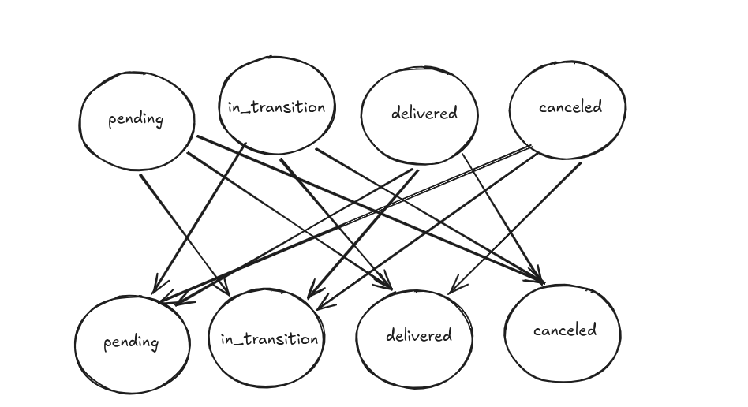
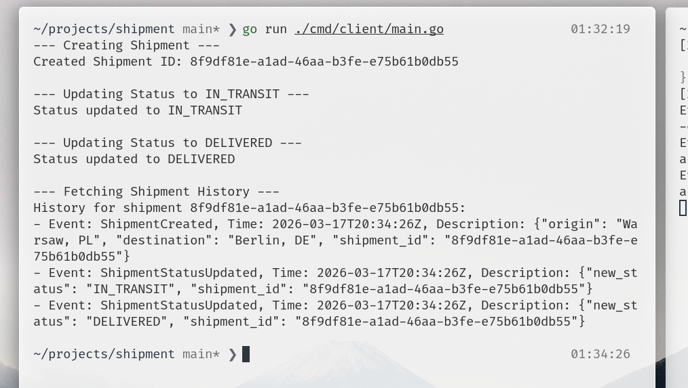
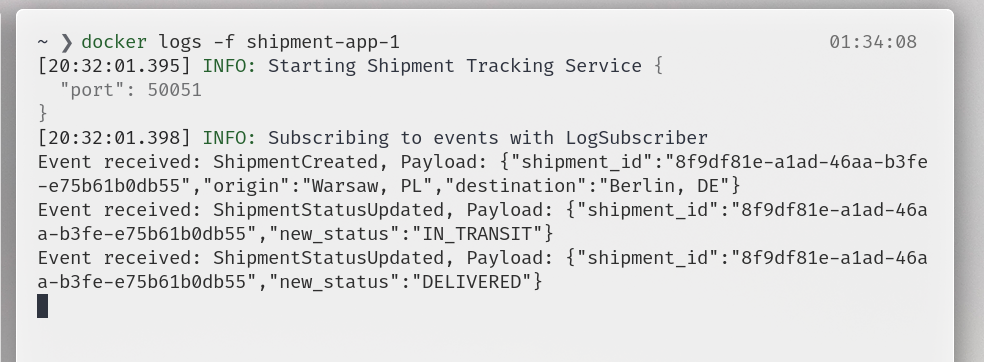

<!-- markdownlint-disable MD010 -->

[Русская версия → RU_README.md](RU_README.md)

# Shipment Tracking Service

---

## How to run the service

### 1. Environment setup

Make sure you have **Docker** and **Docker Compose** installed.
Create a `.env` file in the repository root (or verify the existing one):

**File:** `.env`

```env
POSTGRES_HOST=postgres
POSTGRES_PORT=5432
POSTGRES_USER=postgres
POSTGRES_PASSWORD=secret_password
POSTGRES_DB=shipment_db
GRPC_PORT=50051
LOG_LEVEL=DEBUG
```

### 2. Run with Docker Compose (recommended)

Run the following command to build and start all components:

```bash
docker compose up -d --build
```

This will automatically:

1. Start the **PostgreSQL** database.
2. Start the **migrator** service that applies all SQL migrations.
3. Build and start the main **gRPC server**.

### 3. Manual run (for development)

If you want to run the server locally:

1. Start the DB: `docker compose up -d postgres`.
2. Download dependencies: `go mod download`.
3. Run the server: `go run cmd/main.go`.

---

## How to run the tests

### 1. Unit tests and business logic tests

The project is covered with tests at the domain and application layer. To run them:

```bash
go test ./...
```

## Architecture overview

The service is built using **Clean Architecture** principles and **DDD** (Domain-Driven Design). There are 4 layers: Presentation, Application, Domain, and Infrastructure.

- **Presentation Layer**: gRPC server that handles incoming requests and returns responses.
- **Application Layer**: an intermediate layer that connects business logic to the outside world.
- **Domain Layer**: business logic, models, and specifications. All rules and constraints for managing shipments live here.
- **Infrastructure Layer**: data access implementation (repository).

### Layers interact through interfaces

Repository interface:

**File:** `internal/core/app/repository.go`

```go
type ShipmentRepository interface {
	Create(ctx context.Context, shipment domain.Shipment) error
	GetByID(ctx context.Context, id uuid.UUID) (domain.Shipment, error)
	AddEvent(ctx context.Context, shipmentID uuid.UUID, event kernel.DomainEvent) error
	GetHistory(ctx context.Context, shipmentID uuid.UUID) ([]EventDTO, error)
	UpdateShipmentStatus(ctx context.Context, shipmentID uuid.UUID, newStatus domain.Status) error
}
```

Service interface:

**File:** `internal/core/app/shipment_service.go`

```go
type ShipmentService interface {
	UpdateShipmentStatus(context.Context, string, string) (domain.Shipment, error)
	CreateShipment(context.Context, string, string, domain.Details, domain.DriverDetails) (domain.Shipment, error)
	History(context.Context, string) ([]EventDTO, error)
	GetShipment(context.Context, string) (domain.Shipment, error)
}
```

## Design patterns

To validate business rules I use the "Specification" pattern, which allows encapsulating complex validation rules into separate objects. It also makes it easy to add new rules without changing existing code.

**File:** `internal/core/domain/spec/transition_spec.go` (in code the interface is called `StatusSpec`)

```go
type ShipmentStatusSpec interface {
	Check(shipment domain.Shipment, newStatus domain.Status) (bool, error)
}
```

Also, to solve the status validation problem I used an adjacency matrix that defines allowed transitions between shipment statuses. Since status validation can be complex, I decided to encapsulate this logic into a separate structure that uses the matrix to check whether a transition is allowed.



Because the number of transition rules depends on the number of statuses.

**File:** `internal/core/domain/spec/transition_spec.go`

```go
func DefaultTransitionSpec() (*transitionValidation, error) {
	return NewTransitionSpec(
		WithRule(domain.StatusPending, domain.StatusInTransit, domain.AlwaysAllowRule),
		WithRule(domain.StatusPending, domain.StatusCancelled, domain.AlwaysAllowRule),
		WithRule(domain.StatusPending, domain.StatusDelivered, domain.AlwaysDenyRule),

		...

		WithRule(domain.StatusCancelled, domain.StatusPending, domain.AlwaysDenyRule),
		WithRule(domain.StatusCancelled, domain.StatusInTransit, domain.AlwaysDenyRule),
		WithRule(domain.StatusCancelled, domain.StatusDelivered, domain.AlwaysDenyRule),
	)
}
```

I use a factory to create the specification instance that initializes this matrix based on the current statuses, and it also validates the number of rules to avoid undefined behavior when transitioning to a non-existing status, or when adding a new status that was not reflected in the matrix.

**File:** `internal/core/domain/spec/transition_spec.go`

```go
type transitionValidation struct {
	registry map[domain.Status]map[domain.Status]domain.Rule
}

type TransitionValidationOption func(*transitionValidation)

func NewTransitionSpec(opts ...TransitionValidationOption) (*transitionValidation, error) {

	ts := &transitionValidation{
		registry: make(map[domain.Status]map[domain.Status]domain.Rule),
	}

	for _, opt := range opts {
		opt(ts)
	}

...

	return ts, nil
}

```

I also use DDD patterns like Value Object, Aggregate, and Entity to separate business concepts. For example, `Shipment` is an aggregate that contains entities/events and value objects like `Details` and `DriverDetails`. This helps clearly separate responsibilities across the model and keep aggregate consistency.

**File:** `internal/pkg/kernel/aggregate.go`

```go
type AggregateRoot struct {
	domainEvents []DomainEvent
}

func (ar *AggregateRoot) ApplyDomain(e DomainEvent) {
	ar.domainEvents = append(ar.domainEvents, e)
}

func (ar *AggregateRoot) DomainEvents() []DomainEvent {
	return ar.domainEvents
}

```

In my model, the aggregate is also an entity that produces events describing changes in shipment state. This allows declaring events in business logic and handling them in infrastructure, for example, to persist them to the database or send notifications.

Example of creating an event:

**File:** `internal/core/domain/service/shipment_service.go`

```go
	shipment.ApplyDomain(domain.ShipmentStatusUpdatedEvent{
		ShipmentID: shipment.ID.String(),
		NewStatus:  newStatus,
	})
```

And this is how I handle events in the application layer:

**File:** `internal/core/app/shipment_service.go`

```go
	for _, event := range shipment.DomainEvents() {
		err = s.EventBus.Publish(ctx, EventBusKey, event)
		if err != nil {
			return domain.Shipment{}, err
		}
	}
```

To demonstrate events usage, I implemented a simple EventBus that allows publishing events and subscribing to them.

**File:** `internal/core/app/event_bus.go`

```go
type EventHandler interface {
	Handle(ctx context.Context, event kernel.DomainEvent) error
}

type EventBus struct {
	mu       sync.RWMutex
	handlers map[string][]EventHandler
}
```

As an example subscriber, I implemented a simple logger that prints information about each event to the console.

**File:** `internal/core/app/subscriber.go`

```go
func (l *LogSubscriber) Handle(ctx context.Context, event kernel.DomainEvent) error {
	fmt.Printf("Event received: %s, Payload: %s\n", event.Name(), event.Payload())
	return nil
}
```

To assemble the whole application I built a simple DI container that registers dependencies and makes them easy to access where needed. For convenience, I use a factory to manage dependencies.

**File:** `internal/deps/deps.go`

```go
type Deps struct {
	Repository app.ShipmentRepository
	AppService app.ShipmentService

	EventBus *app.EventBus
	Pool     *pgxpool.Pool
	Server   *grpc.Server
}
```

For SQL queries I use `sqlc` — a code generator that enables type-safe SQL. This approach is more reliable than ad-hoc queries and typically faster and more predictable than an ORM.

For gRPC code generation I use `buf` — a toolchain for managing Protocol Buffers.

## Assumptions

1. Since the task asks to focus on scalability and architecture, I did not implement complex business rules or create additional entities such as Driver, Location, etc. I focused on demonstrating the architecture and design patterns.
2. I also decided not to use a message broker. I use a simple EventBus to demonstrate how I create and handle events.
3. I do not use `.gitignore` because there may be issues with `.env` or generated files from `sqlc` and `buf` (the reviewer may not have the required utilities installed to regenerate them).
4. For convenience, I did not encapsulate some details in business logic, because that would require additional models at every layer.
5. I limited tests to basic business-logic tests only.
6. I use a simple global `slog`.

## Screenshots


